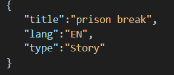

# Movies-Library

## ***Mohammad Abushanab***

---

## WRRC

***

## Overview

## Getting started

>first of all this repo require your machine to have :

    1. `npm`
    2. `git`

    commands

+ Once you download the repo on your command line type `npm i`
  + It will install the dependancies that requires to start the project.

+ **Once you finish go to your terminal and type `nodemon server.js`**

+ >this will start the server on **port 3000**

+ **next go to your browser and type `localhost:3000/`**

### Routes

+ The **`/`** endpoint
+ The favorite page by typing in the url `localhost:3000/favorite`
+ Error Handling pages :
  + Type in the url `localhost:3000/favorite/id`
  if this id is not a number it will respond with an error 500;
  + if you type anything that is not exist it will respond with 404 not found for example
  `localhost:3000/hello`

---

## **Movie Route**

***It's recommended to have postman in order to see the response in a better way but it works on your browser don't worry :)***

**Very important Note once you clone this repo into your machine please note that you need an api_Key in order to this api work**

+ **`/trending`** and you will get all trending movies
+ **`/top-rated`** you will receive all top-rated movies
+ **`/search`** to search about a certain movie but you have  to add `query` in the url parameter **ex:/search?query=spider-man**
+ **`/tv`** fetchs all tv series
+ **`/tv/top-rated`** fetchs all top-rated series
+ **`/search/actor`** search about actor add paramter **`name`** in the url request **ex:/search/actor?name=chris evans** `

---

## Database getting started

+ You should Have **postgres db** on your machine

## **steps**

+ on your terminal type `npm i pg` or `npm i` if you clone this repo for the first time, to install the required library
+ start your postgres **dbms** ` [start postgres](https://tableplus.com/blog/2018/10/how-to-start-stop-restart-postgresql-server.html).

+ create your database using this command on the terminal `CREATE DATABASE 'YOUR DATABASE NAME'`
+ On the command line navigate to the **path of this repo where you have clone** it on your machine
+ type `psql -d 'Your DATABASE NAME THAT YOU'VE JUST CREATED' -f table.schema.sql` this command will insert a table called movie with some dummy data.
+ check the **.env.sample** file to add your configuration  on it and make sure to create a **.env file**

complete this steps and run `nodemon server.js` you should see `server started on port 3000`

## Routes

+ **`/getmovies`** fetch all movies from the database
+ **`/searchmovies`** search for a moive based on his title ex **`/searchmovies?title=Extraction`**
+ **`/addmovies`** adds a new movie based on json object
 note that you need to provide the json with **`title,lang,type`** properties

